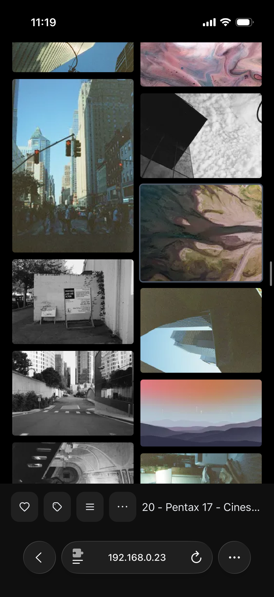

# Cactus

```
    ,*-.
    |  |
,.  |  |
| |_|  | ,.
`---.  |_| |
    |  .--`
    |  |
    |  |

```

Minimal randomized media viewer.

## Getting Started

**Install and run:**

```bash
bun install
bun start -- -d /path/to/your/media/directory -p 3000
```

Open http://localhost:3000 in your browser.

## Base Features

**Flexible Viewing** - A default scrollable random media feed, and a gallery view to browse more flexibily 

**Tagging System** - Powerful tagging system for all the media

**Multiple Data Sources** - Built-in provider system supports local directories and external sources.

**Performance Optimized** - Lazy loading, thumbnail generation, virtual scrolling, and smart caching for smooth browsing of large collections.

## Navigation & Controls

- **Keyboard**: Arrow keys or WASD to navigate
- **Touch**: Swipe up/down on mobile devices  
- **Gallery**: Click any thumbnail to jump to that media

Access settings via the menu button (⋯) to filter media types, manage tags, or rescan directories.

## Screenshots

| View | Desktop | Mobile |
|------|---------|--------|
| **Single Media** |  |  |
| **Gallery View** |  |  |

## Development

```bash
# Frontend development server
bun run dev

# Backend with test data
bun run start:dev
```

The development setup includes hot reloading and sample media files for testing.

## Docker Deployment

```bash
docker build -t cactus .
docker run -p 3000:3000 -v /your/media:/media cactus
```

## Provider System

Cactus supports multiple media sources through its provider architecture:

- **Local Provider**: Scan local directories (`-d /path/to/media`)
- ...

### Build your providers

To build a provider you have to implement the `MediaSourceProvider.js` class and create your own class. This lets you offer your own data source for the media and offer your own set of possible configurations/settings to the user.

## Requirements

- Bun 1.0.0+
- Modern web browser
- FFmpeg (for video thumbnails)

## License

MIT
